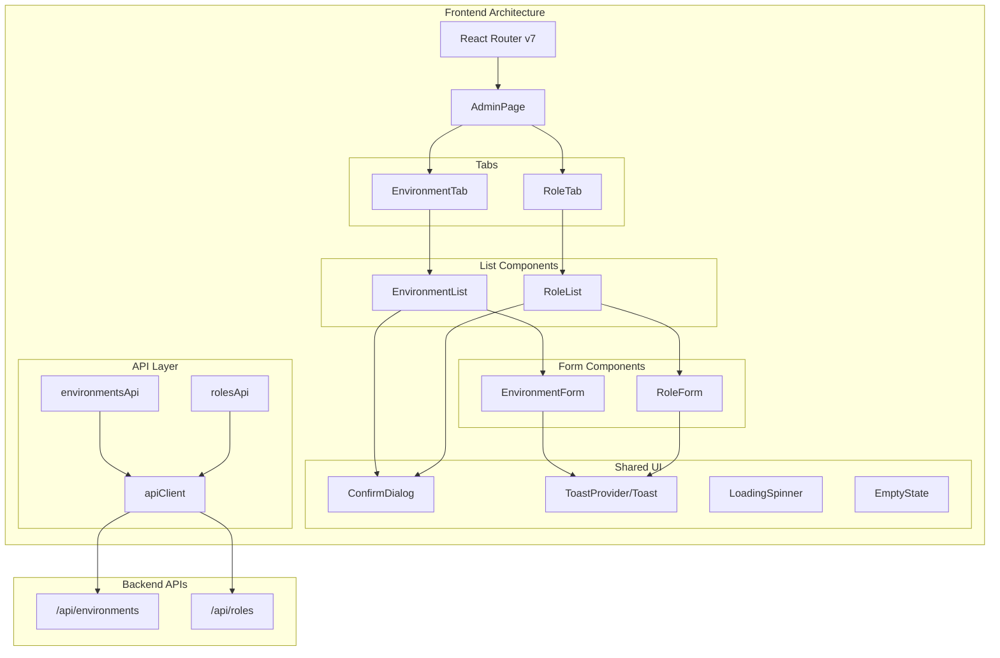
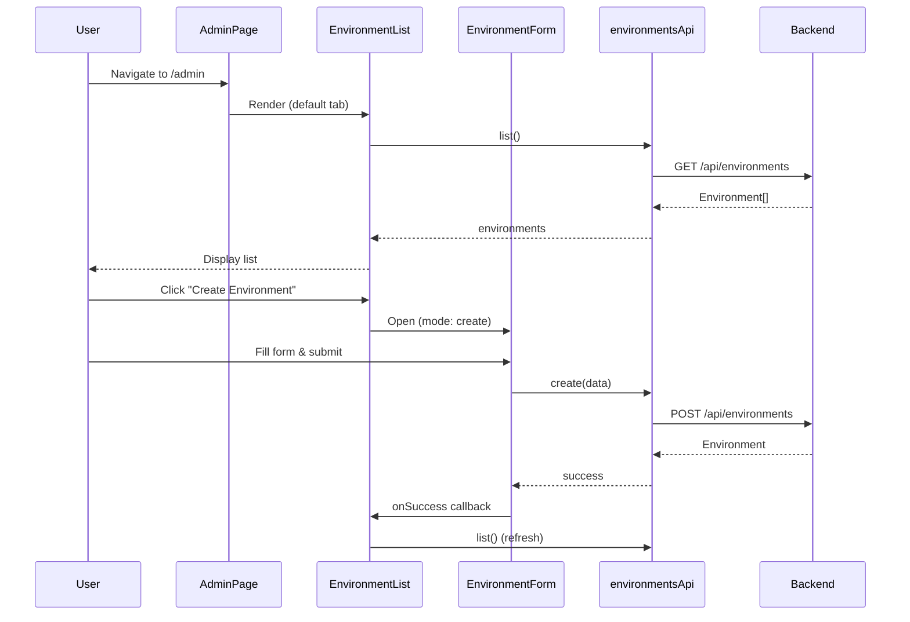

# Admin Dashboard Design Document

## Overview

The Admin Dashboard provides a web-based interface for managing environments (isolated knowledge bases) and user roles in the Fast Chat RAG application. It integrates with existing backend REST APIs (`/api/environments` and `/api/roles`) and follows established frontend patterns using React 19, TypeScript, and Tailwind CSS v4.

The dashboard features:
- Tabbed navigation between Environments and Roles management
- CRUD operations for both entities with form validation
- Responsive design with mobile-first approach (cards on mobile, tables on desktop)
- Toast notifications for user feedback
- Confirmation dialogs for destructive actions
- Accessible UI with keyboard navigation and ARIA support

## Architecture



### State Flow



## Components and Interfaces

### Page Components

#### AdminPage
Main container for the admin dashboard with tab navigation.

```typescript
// frontend/src/pages/AdminPage.tsx
interface AdminPageProps {}

// Internal state
interface AdminPageState {
  activeTab: 'environments' | 'roles';
}
```

### Feature Components

#### EnvironmentList
Displays environments in a table (desktop) or card list (mobile).

```typescript
interface EnvironmentListProps {
  onEdit: (environment: Environment) => void;
  onDelete: (environment: Environment) => void;
}

interface EnvironmentListState {
  environments: Environment[];
  loading: boolean;
  error: string | null;
}
```

#### RoleList
Displays user roles with filtering capabilities.

```typescript
interface RoleListProps {
  environments: Environment[]; // For filter dropdown
  onEdit: (role: UserRole) => void;
  onDelete: (role: UserRole) => void;
}

interface RoleListState {
  roles: UserRole[];
  loading: boolean;
  error: string | null;
  filters: {
    environmentId: string | null;
    userId: string;
  };
}
```

#### EnvironmentForm
Modal form for creating/editing environments.

```typescript
interface EnvironmentFormProps {
  mode: 'create' | 'edit';
  environment?: Environment; // Required when mode is 'edit'
  onSubmit: (data: EnvironmentFormData) => Promise<void>;
  onClose: () => void;
  isOpen: boolean;
}

interface EnvironmentFormData {
  name: string;
  description: string;
}

interface EnvironmentFormState {
  formData: EnvironmentFormData;
  errors: Partial<Record<keyof EnvironmentFormData, string>>;
  submitting: boolean;
}
```

#### RoleForm
Modal form for assigning/updating roles.

```typescript
interface RoleFormProps {
  mode: 'create' | 'edit';
  role?: UserRole; // Required when mode is 'edit'
  environments: Environment[]; // For environment dropdown
  onSubmit: (data: RoleFormData) => Promise<void>;
  onClose: () => void;
  isOpen: boolean;
}

interface RoleFormData {
  userId: string;
  role: 'admin' | 'chat_user';
  environmentId: string;
}

interface RoleFormState {
  formData: RoleFormData;
  errors: Partial<Record<keyof RoleFormData, string>>;
  submitting: boolean;
}
```

### Shared UI Components

#### ConfirmDialog
Reusable confirmation modal for destructive actions.

```typescript
interface ConfirmDialogProps {
  isOpen: boolean;
  title: string;
  message: string;
  confirmLabel?: string;
  cancelLabel?: string;
  variant?: 'danger' | 'warning';
  onConfirm: () => void;
  onCancel: () => void;
  loading?: boolean;
}
```

#### Toast System
Context-based toast notification system.

```typescript
interface Toast {
  id: string;
  type: 'success' | 'error' | 'info';
  message: string;
  duration?: number; // ms, undefined = persistent
}

interface ToastContextValue {
  toasts: Toast[];
  addToast: (toast: Omit<Toast, 'id'>) => void;
  removeToast: (id: string) => void;
}
```

#### LoadingSpinner
Consistent loading indicator.

```typescript
interface LoadingSpinnerProps {
  size?: 'sm' | 'md' | 'lg';
  className?: string;
}
```

#### EmptyState
Placeholder for empty lists.

```typescript
interface EmptyStateProps {
  icon?: React.ReactNode;
  title: string;
  description?: string;
  action?: {
    label: string;
    onClick: () => void;
  };
}
```

### API Client Modules

#### environmentsApi

```typescript
// frontend/src/api/environments.ts
export const environmentsApi = {
  list: (skip?: number, limit?: number) => Promise<Environment[]>,
  get: (id: string) => Promise<Environment>,
  create: (data: EnvironmentCreate) => Promise<Environment>,
  update: (id: string, data: EnvironmentUpdate) => Promise<Environment>,
  delete: (id: string) => Promise<EnvironmentDeleteResponse>,
};
```

#### rolesApi

```typescript
// frontend/src/api/roles.ts
export const rolesApi = {
  list: (filters?: { environmentId?: string; userId?: string }) => Promise<UserRole[]>,
  get: (id: string) => Promise<UserRole>,
  create: (data: UserRoleCreate) => Promise<UserRole>,
  update: (id: string, data: UserRoleUpdate) => Promise<UserRole>,
  delete: (id: string) => Promise<UserRoleDeleteResponse>,
};
```

## Data Models

### TypeScript Interfaces

```typescript
// frontend/src/types/admin.ts

// Environment types
export interface Environment {
  id: string;
  name: string;
  description: string | null;
  created_by: string;
  created_at: string;
  updated_at: string;
}

export interface EnvironmentCreate {
  name: string;
  description?: string;
}

export interface EnvironmentUpdate {
  name?: string;
  description?: string;
}

export interface EnvironmentDeleteResponse {
  message: string;
  deleted_environment_id: string;
  deleted_documents_count: number;
}

// User Role types
export type RoleType = 'admin' | 'chat_user';

export interface UserRole {
  id: string;
  user_id: string;
  role: RoleType;
  environment_id: string;
  created_at: string;
}

export interface UserRoleCreate {
  user_id: string;
  role: RoleType;
  environment_id: string;
}

export interface UserRoleUpdate {
  role: RoleType;
}

export interface UserRoleDeleteResponse {
  message: string;
  deleted_role_id: string;
}

// Extended type for display (with environment name)
export interface UserRoleWithEnvironment extends UserRole {
  environment_name?: string;
}
```

### API Response Mapping

| Backend Field | Frontend Field | Notes |
|--------------|----------------|-------|
| `id` (UUID) | `id` (string) | UUID serialized as string |
| `created_at` (datetime) | `created_at` (string) | ISO 8601 format |
| `updated_at` (datetime) | `updated_at` (string) | ISO 8601 format |
| `environment_id` (UUID) | `environment_id` (string) | UUID serialized as string |


## Responsive Layout Strategy

### Breakpoints

Following Tailwind CSS v4 defaults:
- **Mobile**: `< 768px` (default styles)
- **Tablet**: `md:` (768px - 1023px)
- **Desktop**: `lg:` (1024px+)

### Layout Behavior by Viewport

| Component | Mobile (<768px) | Tablet (768-1023px) | Desktop (1024px+) |
|-----------|-----------------|---------------------|-------------------|
| Navigation | Hamburger menu | Full nav bar | Full nav bar |
| Environment List | Stacked cards | 2-column cards | Table view |
| Role List | Stacked cards | 2-column cards | Table view |
| Forms | Full-screen modal | Centered modal (480px) | Centered modal (480px) |
| Confirm Dialog | Full-width bottom sheet | Centered modal | Centered modal |
| Toast | Bottom center | Top right | Top right |

### Touch Targets

All interactive elements maintain minimum 44x44px touch targets on mobile:
- Buttons: `min-h-[44px] min-w-[44px]`
- Table/card action buttons: `p-3` minimum
- Form inputs: `h-11` (44px)

### Component Structure

```
AdminPage
├── Header (with mobile hamburger)
├── TabNavigation
│   ├── Environments Tab
│   └── Roles Tab
├── TabContent
│   ├── EnvironmentList (or RoleList)
│   │   ├── Desktop: Table
│   │   └── Mobile: CardList
│   └── ActionBar (Create button)
├── EnvironmentForm (Modal)
├── RoleForm (Modal)
├── ConfirmDialog (Modal)
└── ToastContainer
```

### CSS Classes Pattern

```css
/* Mobile-first responsive pattern */
.admin-list {
  @apply flex flex-col gap-4;
}

/* Desktop table view */
@screen lg {
  .admin-list {
    @apply table w-full;
  }
}

/* Card component (mobile) */
.admin-card {
  @apply bg-white rounded-lg shadow-sm border border-gray-200 p-4;
}

/* Form modal responsive */
.form-modal {
  @apply fixed inset-0 bg-white z-50; /* Mobile: full screen */
}

@screen md {
  .form-modal {
    @apply inset-auto top-1/2 left-1/2 -translate-x-1/2 -translate-y-1/2
           max-w-md w-full rounded-lg shadow-xl;
  }
}
```

## File Structure

```
frontend/src/
├── api/
│   ├── environments.ts      # Environment API client
│   └── roles.ts             # Roles API client
├── components/
│   ├── admin/
│   │   ├── EnvironmentList.tsx
│   │   ├── EnvironmentCard.tsx
│   │   ├── EnvironmentForm.tsx
│   │   ├── RoleList.tsx
│   │   ├── RoleCard.tsx
│   │   ├── RoleForm.tsx
│   │   ├── RoleFilters.tsx
│   │   └── index.ts
│   └── ui/
│       ├── ConfirmDialog.tsx
│       ├── Toast.tsx
│       ├── ToastProvider.tsx
│       ├── LoadingSpinner.tsx
│       ├── EmptyState.tsx
│       ├── Modal.tsx
│       └── index.ts
├── hooks/
│   └── useToast.ts
├── pages/
│   ├── AdminPage.tsx
│   └── index.ts (add export)
├── types/
│   ├── admin.ts             # Admin-specific types
│   └── index.ts (add exports)
└── router.tsx (add /admin route)
```


## Correctness Properties

*A property is a characteristic or behavior that should hold true across all valid executions of a system—essentially, a formal statement about what the system should do. Properties serve as the bridge between human-readable specifications and machine-verifiable correctness guarantees.*

### Property 1: Environment list displays all required information

*For any* environment in the list, the rendered output should include the environment's name, description (or placeholder if null), created_by, created_at, and document count.

**Validates: Requirements 2.2, 2.3**

### Property 2: Environment list displays all required actions

*For any* environment in the list, the rendered output should include both an edit action and a delete action that are clickable/tappable.

**Validates: Requirements 4.1, 5.1**

### Property 3: Environment name validation rejects invalid input

*For any* string that is empty or consists entirely of whitespace, the environment form should prevent submission and display a validation error.

**Validates: Requirements 3.4**

### Property 4: Role list displays all required information

*For any* role in the list, the rendered output should include the user_id, role type, environment name, and created_at.

**Validates: Requirements 6.2**

### Property 5: Role list environment filter returns correct results

*For any* environment filter selection, all displayed roles should have an environment_id matching the selected environment, and no roles from other environments should be shown.

**Validates: Requirements 6.3**

### Property 6: Role list user filter returns correct results

*For any* user_id filter input, all displayed roles should have a user_id that contains or matches the filter string, and no non-matching roles should be shown.

**Validates: Requirements 6.4**

### Property 7: Role list displays all required actions

*For any* role in the list, the rendered output should include both an edit action and a delete action that are clickable/tappable.

**Validates: Requirements 8.1, 9.1**

### Property 8: Role form validation rejects incomplete input

*For any* combination where user_id, role, or environment_id is empty/unselected, the role form should prevent submission and display appropriate validation errors.

**Validates: Requirements 7.4**

### Property 9: Interactive elements meet minimum touch target size

*For any* interactive element (button, link, form control) in the admin dashboard, the element should have a minimum clickable area of 44x44 pixels.

**Validates: Requirements 10.4**

### Property 10: API operations display appropriate loading states

*For any* API request in progress, the UI should display a loading indicator, and for form submissions, the submit button should be disabled.

**Validates: Requirements 11.1, 11.2**

### Property 11: API failures display user-friendly error messages

*For any* API request that fails, the UI should display a user-friendly error message (not raw error codes or stack traces).

**Validates: Requirements 11.3**

### Property 12: Interactive elements are accessible

*For any* interactive element in the admin dashboard, the element should use semantic HTML (button, a, input), have an accessible name (via text content, aria-label, or aria-labelledby), and be reachable via keyboard navigation (focusable with appropriate tabindex).

**Validates: Requirements 12.1, 12.2, 12.3**

## Error Handling

### API Error Handling

| HTTP Status | Error Type | User Message | UI Behavior |
|-------------|------------|--------------|-------------|
| 400 | Validation Error | Display field-specific errors | Highlight invalid fields |
| 404 | Not Found | "Resource not found" | Show error toast, refresh list |
| 409 | Conflict | "Name already exists" or "Role already assigned" | Display inline form error |
| 500 | Server Error | "Something went wrong. Please try again." | Show error toast with retry |
| Network Error | Connection | "Unable to connect. Check your connection." | Show error toast with retry |

### Form Validation Errors

```typescript
interface ValidationErrors {
  name?: string;      // "Name is required", "Name must be 1-255 characters"
  description?: string;
  userId?: string;    // "User ID is required"
  role?: string;      // "Role is required"
  environmentId?: string; // "Environment is required"
}
```

### Error Recovery Strategies

1. **List fetch failures**: Display error message with "Retry" button that re-fetches data
2. **Form submission failures**: Keep form open with error message, allow user to correct and retry
3. **Delete failures**: Close confirmation dialog, show error toast, list remains unchanged
4. **Network errors**: Show persistent error toast with retry action

### Toast Notification Behavior

```typescript
const toastConfig = {
  success: {
    duration: 5000,      // Auto-dismiss after 5 seconds
    position: {
      mobile: 'bottom-center',
      desktop: 'top-right'
    }
  },
  error: {
    duration: undefined, // Persistent until dismissed
    position: {
      mobile: 'bottom-center', 
      desktop: 'top-right'
    }
  }
};
```

## Testing Strategy

### Dual Testing Approach

This feature requires both unit tests and property-based tests for comprehensive coverage:

- **Unit tests**: Verify specific examples, edge cases, error conditions, and UI interactions
- **Property tests**: Verify universal properties across all inputs using randomized data

### Property-Based Testing Configuration

- **Library**: fast-check (JavaScript property-based testing library)
- **Minimum iterations**: 100 per property test
- **Tag format**: `Feature: admin-dashboard, Property {number}: {property_text}`

### Unit Test Coverage

| Component | Test Focus |
|-----------|------------|
| AdminPage | Tab switching, route rendering |
| EnvironmentList | Loading state, empty state, error state, list rendering |
| EnvironmentForm | Form validation, create mode, edit mode, submission |
| RoleList | Loading state, empty state, filtering, list rendering |
| RoleForm | Form validation, create mode, edit mode (read-only fields) |
| ConfirmDialog | Open/close, focus trap, confirm/cancel actions |
| Toast | Auto-dismiss timing, manual dismiss, positioning |
| environmentsApi | API calls, error handling |
| rolesApi | API calls with filters, error handling |

### Property Test Coverage

| Property | Test Implementation |
|----------|---------------------|
| Property 1 | Generate random environments, verify all fields rendered |
| Property 2 | Generate random environments, verify edit/delete actions present |
| Property 3 | Generate whitespace strings, verify form rejects submission |
| Property 4 | Generate random roles, verify all fields rendered |
| Property 5 | Generate roles with various environments, apply filter, verify results |
| Property 6 | Generate roles with various user_ids, apply filter, verify results |
| Property 7 | Generate random roles, verify edit/delete actions present |
| Property 8 | Generate partial form data, verify form rejects submission |
| Property 9 | Query all interactive elements, verify minimum dimensions |
| Property 10 | Mock API delays, verify loading indicators appear |
| Property 11 | Mock API failures, verify error messages are user-friendly |
| Property 12 | Query all interactive elements, verify accessibility attributes |

### Test File Structure

```
frontend/src/
├── components/
│   ├── admin/
│   │   ├── EnvironmentList.test.tsx
│   │   ├── EnvironmentForm.test.tsx
│   │   ├── RoleList.test.tsx
│   │   ├── RoleForm.test.tsx
│   │   └── RoleFilters.test.tsx
│   └── ui/
│       ├── ConfirmDialog.test.tsx
│       ├── Toast.test.tsx
│       └── Modal.test.tsx
├── pages/
│   └── AdminPage.test.tsx
├── api/
│   ├── environments.test.ts
│   └── roles.test.ts
└── __tests__/
    └── admin.property.test.ts  # Property-based tests
```

### Example Property Test

```typescript
// admin.property.test.ts
import { fc } from 'fast-check';
import { render, screen } from '@testing-library/react';
import { EnvironmentList } from '../components/admin';

// Feature: admin-dashboard, Property 1: Environment list displays all required information
describe('Property 1: Environment list displays all required information', () => {
  it('should display all required fields for any environment', () => {
    fc.assert(
      fc.property(
        fc.record({
          id: fc.uuid(),
          name: fc.string({ minLength: 1, maxLength: 255 }),
          description: fc.option(fc.string()),
          created_by: fc.string({ minLength: 1 }),
          created_at: fc.date().map(d => d.toISOString()),
          updated_at: fc.date().map(d => d.toISOString()),
        }),
        (environment) => {
          render(<EnvironmentList environments={[environment]} />);
          
          expect(screen.getByText(environment.name)).toBeInTheDocument();
          expect(screen.getByText(environment.created_by)).toBeInTheDocument();
          // Verify created_at is displayed (formatted)
          expect(screen.getByText(/\d{1,2}\/\d{1,2}\/\d{4}/)).toBeInTheDocument();
        }
      ),
      { numRuns: 100 }
    );
  });
});
```

