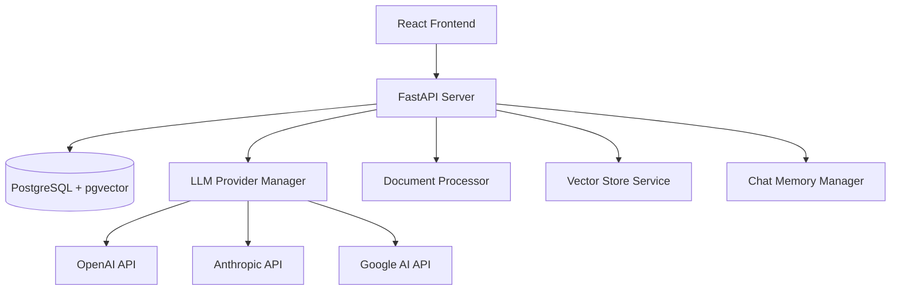
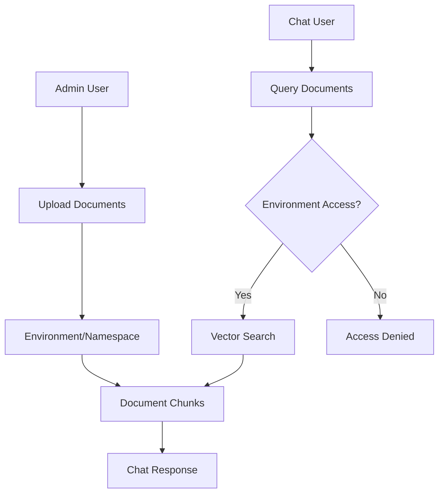

# Design Document

## Overview

The RAG chatbot application will be built as a modern web application with a microservices-oriented architecture. The system consists of a React-based frontend, a Python FastAPI backend API, PostgreSQL database with pgvector extension for vector storage, and integration with multiple LLM providers. The application emphasizes modularity, scalability, and cost optimization through intelligent provider selection.

## Architecture

### High-Level Architecture



### Technology Stack

- **Frontend**: React 18 with TypeScript, Tailwind CSS for styling
- **Backend**: Python 3.11+ with FastAPI and Pydantic
- **Database**: PostgreSQL 15+ with pgvector extension
- **Vector Operations**: pgvector for similarity search
- **File Processing**: PyPDF2/pdfplumber, python-docx, markdown
- **Embeddings**: OpenAI text-embedding-3-small or sentence-transformers
- **LLM Integration**: openai, anthropic, google-generativeai Python SDKs
- **Memory Management**: LangChain for conversation memory and chain orchestration
- **RAG Framework**: LangChain or LlamaIndex for RAG pipeline orchestration
- **Database ORM**: SQLAlchemy with asyncpg for async PostgreSQL operations
- **HTTP Client**: httpx for async API calls
- **Token Management**: tiktoken for accurate token counting

## Components and Interfaces

### 1. Document Processing Service

**Purpose**: Handle document upload, text extraction, chunking, and embedding generation.

**Key Classes**:
- `DocumentProcessor`: Main orchestrator for document processing
- `TextExtractor`: Extract text from various file formats
- `TextChunker`: Implement chunking with overlap strategies
- `EmbeddingGenerator`: Generate embeddings using configured model

**Interfaces**:
```python
from pydantic import BaseModel
from typing import Optional, List
from abc import ABC, abstractmethod

class ChunkMetadata(BaseModel):
    document_id: str
    chunk_index: int
    start_position: int
    end_position: int
    overlap: bool

class TextChunk(BaseModel):
    id: str
    content: str
    metadata: ChunkMetadata
    embedding: Optional[List[float]] = None

class DocumentProcessor(ABC):
    @abstractmethod
    async def process_document(self, file: bytes, filename: str, user_id: str) -> ProcessingResult:
        pass
    
    @abstractmethod
    async def extract_text(self, file: bytes, content_type: str) -> str:
        pass
    
    @abstractmethod
    async def chunk_text(self, text: str, options: ChunkingOptions) -> List[TextChunk]:
        pass
```

### 2. Vector Store Service

**Purpose**: Manage vector storage, retrieval, and similarity search operations.

**Key Classes**:
- `VectorStore`: Main interface for vector operations
- `PostgreSQLVectorStore`: PostgreSQL implementation with pgvector
- `SimilaritySearch`: Handle semantic search queries

**Interfaces**:
```python
class DocumentMetadata(BaseModel):
    id: str
    filename: str
    user_id: str
    upload_date: datetime

class SearchResult(BaseModel):
    chunk: TextChunk
    similarity: float
    document: DocumentMetadata

class VectorStore(ABC):
    @abstractmethod
    async def store_chunks(self, chunks: List[TextChunk]) -> None:
        pass
    
    @abstractmethod
    async def search_similar(self, query: str, limit: int = 5) -> List[SearchResult]:
        pass
    
    @abstractmethod
    async def delete_document(self, document_id: str) -> None:
        pass
```

### 3. LLM Provider Manager

**Purpose**: Manage multiple LLM providers, cost optimization, and failover.

**Key Classes**:
- `LLMProviderManager`: Orchestrate provider selection and requests
- `CostCalculator`: Calculate and compare costs across providers
- `ProviderAdapter`: Abstract interface for different LLM providers

**Interfaces**:
```python
class LLMResponse(BaseModel):
    content: str
    tokens_used: int
    cost: float
    provider: str

class LLMProvider(ABC):
    @abstractmethod
    async def generate_response(self, prompt: str, context: List[str]) -> LLMResponse:
        pass
    
    @abstractmethod
    def calculate_cost(self, tokens: int) -> float:
        pass
    
    @abstractmethod
    async def is_available(self) -> bool:
        pass
```

### 4. Chat Memory Manager

**Purpose**: Manage conversation history, token optimization, and context compression.

**Framework Options**:

1. **LangChain Memory (Recommended)**:
   - `ConversationBufferMemory`: Keeps all messages in memory until token limit
   - `ConversationSummaryMemory`: Automatically summarizes old conversations
   - `ConversationBufferWindowMemory`: Keeps only last N messages
   - `ConversationSummaryBufferMemory`: Hybrid approach with summary + recent messages
   - `VectorStoreRetrieverMemory`: Stores memories in vector database for semantic retrieval

2. **LlamaIndex Memory**:
   - `ChatMemoryBuffer`: Simple buffer for chat history
   - `VectorMemory`: Vector-based memory storage
   - Built-in integration with chat engines

3. **Mem0 (Memory Layer)**:
   - Persistent memory across sessions
   - User preference learning
   - Contextual memory retrieval
   - Multi-user memory isolation

4. **Redis-based Memory**:
   - Fast in-memory storage for active conversations
   - Session persistence across server restarts
   - Distributed memory for multi-instance deployments

**Recommended Approach**: 
- Primary: LangChain's `ConversationSummaryBufferMemory` for automatic summarization
- Secondary: Redis for session persistence and fast retrieval
- Enhancement: Custom cost-aware memory manager that switches strategies based on token costs

**Key Classes**:
- `ChatMemoryManager`: Wrapper around LangChain memory with cost optimization
- `ConversationSummarizer`: Extends LangChain's ConversationSummaryMemory
- `TokenCounter`: Track and manage token usage across providers

**Interfaces**:
```python
from datetime import datetime
from enum import Enum

class MessageRole(str, Enum):
    USER = "user"
    ASSISTANT = "assistant"

class ChatMessage(BaseModel):
    id: str
    conversation_id: str
    role: MessageRole
    content: str
    timestamp: datetime
    token_count: int

class ChatMemory(ABC):
    @abstractmethod
    async def add_message(self, message: ChatMessage) -> None:
        pass
    
    @abstractmethod
    async def get_context(self, conversation_id: str, max_tokens: int) -> List[ChatMessage]:
        pass
    
    @abstractmethod
    async def summarize_old_messages(self, conversation_id: str) -> None:
        pass
```

### 5. Chat API Controller

**Purpose**: Handle chat requests, orchestrate RAG pipeline, and manage responses.

**Key Classes**:
- `ChatController`: Main chat endpoint handler
- `RAGPipeline`: Orchestrate retrieval and generation
- `ResponseFormatter`: Format and structure responses

## Data Models

### Database Schema

```sql
-- Documents table
CREATE TABLE documents (
    id UUID PRIMARY KEY DEFAULT gen_random_uuid(),
    user_id VARCHAR(255) NOT NULL,
    filename VARCHAR(255) NOT NULL,
    file_size INTEGER NOT NULL,
    content_type VARCHAR(100) NOT NULL,
    upload_date TIMESTAMP DEFAULT CURRENT_TIMESTAMP,
    processing_status VARCHAR(50) DEFAULT 'pending'
);

-- Document chunks with vector embeddings
CREATE TABLE document_chunks (
    id UUID PRIMARY KEY DEFAULT gen_random_uuid(),
    document_id UUID REFERENCES documents(id) ON DELETE CASCADE,
    chunk_index INTEGER NOT NULL,
    content TEXT NOT NULL,
    start_position INTEGER NOT NULL,
    end_position INTEGER NOT NULL,
    token_count INTEGER NOT NULL,
    embedding vector(1536), -- OpenAI embedding dimension
    created_at TIMESTAMP DEFAULT CURRENT_TIMESTAMP
);

-- Conversations
CREATE TABLE conversations (
    id UUID PRIMARY KEY DEFAULT gen_random_uuid(),
    user_id VARCHAR(255) NOT NULL,
    title VARCHAR(255),
    created_at TIMESTAMP DEFAULT CURRENT_TIMESTAMP,
    updated_at TIMESTAMP DEFAULT CURRENT_TIMESTAMP
);

-- Chat messages
CREATE TABLE chat_messages (
    id UUID PRIMARY KEY DEFAULT gen_random_uuid(),
    conversation_id UUID REFERENCES conversations(id) ON DELETE CASCADE,
    role VARCHAR(20) NOT NULL CHECK (role IN ('user', 'assistant')),
    content TEXT NOT NULL,
    token_count INTEGER NOT NULL,
    created_at TIMESTAMP DEFAULT CURRENT_TIMESTAMP
);

-- LLM usage tracking
CREATE TABLE llm_usage (
    id UUID PRIMARY KEY DEFAULT gen_random_uuid(),
    conversation_id UUID REFERENCES conversations(id),
    provider VARCHAR(50) NOT NULL,
    model VARCHAR(100) NOT NULL,
    input_tokens INTEGER NOT NULL,
    output_tokens INTEGER NOT NULL,
    cost DECIMAL(10, 6) NOT NULL,
    created_at TIMESTAMP DEFAULT CURRENT_TIMESTAMP
);

-- Create vector similarity index
CREATE INDEX ON document_chunks USING ivfflat (embedding vector_cosine_ops);
```

### Configuration Models

```python
class ModelConfig(BaseModel):
    name: str
    input_cost_per_1k_tokens: float
    output_cost_per_1k_tokens: float
    max_tokens: int
    capabilities: List[str]

class LLMProviderConfig(BaseModel):
    name: str
    api_key: str
    models: List[ModelConfig]
    enabled: bool = True
    priority: int = 1
```

## Error Handling

### Error Categories and Strategies

1. **Document Processing Errors**
   - File format validation errors: Return specific format requirements
   - File size errors: Provide clear size limits and suggestions
   - Text extraction failures: Offer alternative formats or manual input

2. **LLM Provider Errors**
   - API rate limits: Implement exponential backoff and provider switching
   - Authentication errors: Validate API keys and provide setup guidance
   - Model unavailability: Automatic fallback to alternative models

3. **Database Errors**
   - Connection failures: Implement connection pooling and retry logic
   - Vector search errors: Fallback to text-based search when possible
   - Storage failures: Queue operations for retry

4. **Memory Management Errors**
   - Token limit exceeded: Automatic conversation summarization
   - Context retrieval failures: Graceful degradation with limited context

### Error Response Format

```typescript
interface ErrorResponse {
  error: {
    code: string
    message: string
    details?: any
    retryable: boolean
  }
}
```

## Testing Strategy

### Unit Testing
- **Document Processing**: Test text extraction, chunking algorithms, embedding generation
- **Vector Operations**: Test similarity search accuracy and performance
- **LLM Integration**: Mock provider responses and test cost calculations
- **Memory Management**: Test token counting and conversation summarization

### Integration Testing
- **End-to-End RAG Pipeline**: Test complete document upload to chat response flow
- **Provider Failover**: Test automatic switching between LLM providers
- **Database Operations**: Test vector storage and retrieval with real data

### Performance Testing
- **Vector Search Performance**: Benchmark similarity search with various dataset sizes
- **Concurrent User Load**: Test system behavior under multiple simultaneous chats
- **Memory Usage**: Monitor token optimization and conversation compression

### Test Data Strategy
- Create sample documents of various formats and sizes
- Generate test conversations with different complexity levels
- Mock LLM provider responses for consistent testing

### Monitoring and Observability
- **Application Metrics**: Response times, error rates, user engagement
- **Cost Tracking**: Real-time monitoring of LLM usage and expenses
- **Performance Metrics**: Vector search latency, document processing times
- **Health Checks**: Provider availability, database connectivity, system resources

## User Roles and Environment Management

### Role-Based Access Control

The system implements two distinct user roles to separate document management from chat interactions:

1. **Admin Role**: Responsible for environment preparation and document management
   - Upload, update, and delete documents
   - Create and manage environments/namespaces
   - Assign documents to specific environments
   - Monitor document processing status

2. **Chat User Role**: End users who interact with the chatbot
   - Query documents within assigned environments
   - Create and manage their own conversations
   - Access documents uploaded by admins in their environment

### Environment/Namespace Model

```sql
-- Environments table for isolated knowledge bases
CREATE TABLE environments (
    id UUID PRIMARY KEY DEFAULT gen_random_uuid(),
    name VARCHAR(255) NOT NULL UNIQUE,
    description TEXT,
    created_by VARCHAR(255) NOT NULL,
    created_at TIMESTAMP DEFAULT CURRENT_TIMESTAMP,
    updated_at TIMESTAMP DEFAULT CURRENT_TIMESTAMP
);

-- User roles table
CREATE TABLE user_roles (
    id UUID PRIMARY KEY DEFAULT gen_random_uuid(),
    user_id VARCHAR(255) NOT NULL,
    role VARCHAR(50) NOT NULL CHECK (role IN ('admin', 'chat_user')),
    environment_id UUID REFERENCES environments(id) ON DELETE CASCADE,
    created_at TIMESTAMP DEFAULT CURRENT_TIMESTAMP,
    UNIQUE(user_id, environment_id)
);

-- Update documents table to reference environment
ALTER TABLE documents ADD COLUMN environment_id UUID REFERENCES environments(id);
CREATE INDEX idx_documents_environment ON documents(environment_id);
```

### Access Control Flow



### API Endpoints for Role Management

```python
# Environment management (Admin only)
POST /api/v1/environments              # Create environment
GET /api/v1/environments               # List environments
PUT /api/v1/environments/{id}          # Update environment
DELETE /api/v1/environments/{id}       # Delete environment

# Document management with environment (Admin only)
POST /api/v1/environments/{env_id}/documents/upload
GET /api/v1/environments/{env_id}/documents
DELETE /api/v1/environments/{env_id}/documents/{doc_id}

# Chat with environment context (Chat users)
POST /api/v1/environments/{env_id}/chat/conversations
POST /api/v1/environments/{env_id}/chat/conversations/{conv_id}/messages
```